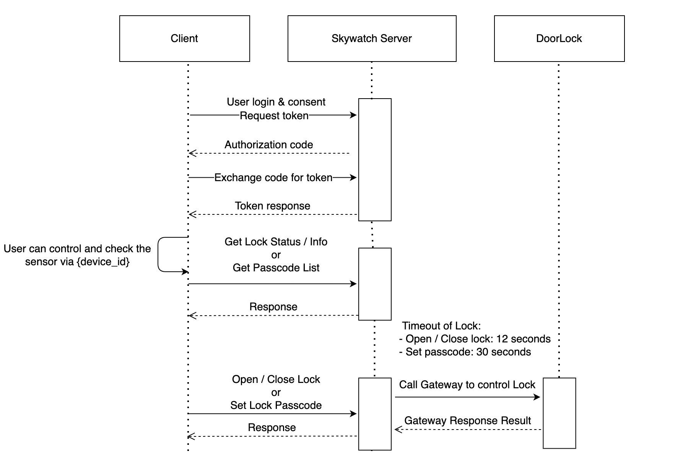

# Lock API Document

**Reminder: Only support Doorlock sensor for now!**

### Error Handle

[Doorlock Error Response](https://gist.github.com/alon21034/555203ac0fbcf748dde5fcc8a5122f22#file-error_response-md)

### Process



### initialize

This is a function which has to initiate at the beginning.

```javascript
import Skywatch from '@skywatch/js';
Skywatch.initialize('/your_server_url_with_skywatch_library', 'token');
```

### Device List

```javascript
Skywatch.Device.getInfo();
```

#### Example Output:

```json
[
  {
    "id": "1",
    "model_id": "74",
    "parent": "1",
    "online": "1",
    "name": "Gateway 2",
    "active": "1",
    "type": "own",
    "share_permission": "111",
    "device_type": "gateway",
    "ibit": "0",
    "mobile_view_available": "0",
    "sphere_available": "0",
    "model": "74",
    "armactive": "1",
    "audio_id": "0",
    "owner_name": ""
  },
  {
    "id": "3",
    "model_id": "63",
    "parent": "1",
    "online": "1",
    "name": "Door Lock",
    "active": "1",
    "type": "own",
    "share_permission": "111",
    "device_type": "sensor",
    "ibit": "0",
    "mobile_view_available": "1",
    "sphere_available": "0",
    "params": {
      "background_color": {
        "r": "0",
        "g": "165",
        "b": "230",
        "a": "100",
        "type": "color",
        "raw": ""
      },
      "image": {
        "value": "/api/v2/models/doorlock/image?status=online&value=__U__",
        "type": "image",
        "raw": "__U__"
      },
      "name": {
        "value": "Door Lock",
        "type": "text",
        "raw": "Door Lock"
      },
      "value_control": {
        "value": "--",
        "type": "text",
        "title": "",
        "raw": ""
      },
      "user_code": {
        "value": "api/v2/devices/3/doorcodeview",
        "type": "ext_page",
        "text": "管理通行密碼"
      },
      "switch_control": {
        "value": "__U__",
        "type": "switch",
        "raw": ""
      },
      "detail_control": {
        "value": "",
        "type": "list",
        "color": "blue",
        "trigger_based": "1"
      }
    },
    "modes_available": [
      {
        "key": "daily",
        "title": "日"
      },
      {
        "key": "weekly",
        "title": "週"
      },
      {
        "key": "monthly",
        "title": "月"
      }
    ],
    "model": "doorlock",
    "armactive": "1",
    "audio_id": "0",
    "owner_name": ""
  }
]
```

| Parameter  | Description                                                                                    |
| ---------- | ---------------------------------------------------------------------------------------------- |
| `id`       | Device Id                                                                                      |
| `name`     | Device name                                                                                    |
| `online`   | Online: 1, Offline: 0                                                                          |
| `model_id` | Gateway 2: 74, Gateway 2.5: 91, DoorLock: 63, PowerLock(斷電解鎖): 83, PowerLock(上電解鎖): 84 |

### Lock Info

```javascript
Skywatch.Lock.getInfo(deviceId);
```

| Property   | Type     | Required | Description |
| ---------- | -------- | -------- | ----------- |
| `deviceId` | `string` | YES      | Sensor id   |

#### Example Output:

```json
{
  "cameraStatusCode": "online",
  "firmwareUpgradeAvailable": "false",
  "rebootAvailable": "true",
  "wrong_password": "0",
  "cameraAlert": "false",
  "cameraServiceImage": "",
  "has_er": "0",
  "has_cr": "0",
  "has_cr_pro": "0",
  "recover_from_sd": "0",
  "params": {
    "background_color": {
      "r": "0",
      "g": "165",
      "b": "230",
      "a": "100",
      "type": "color",
      "raw": ""
    },
    "image": {
      "value": "/api/v2/models/doorlock/image?status=online&value=0",
      "type": "image",
      "raw": "0"
    },
    "name": {
      "value": "Door Lock",
      "type": "text",
      "raw": "Door Lock"
    },
    "value_control": {
      "value": "開著",
      "type": "text",
      "title": "",
      "raw": "0"
    },
    "user_code": {
      "value": "api/v2/devices/3/doorcodeview",
      "type": "ext_page",
      "text": "管理通行密碼"
    },
    "switch_control": {
      "value": "0",
      "type": "switch",
      "raw": "0"
    },
    "detail_control": {
      "value": "",
      "type": "list",
      "color": "blue",
      "trigger_based": "1"
    },
    "master_code": "1234",
    "is_online": "1"
  },
  "modes_available": [
    {
      "key": "daily",
      "title": "日"
    },
    {
      "key": "weekly",
      "title": "週"
    },
    {
      "key": "monthly",
      "title": "月"
    }
  ],
  "master_code": "1234",
  "max_code_num": "30"
}
```

#### Note:

```
If the model_id is 63 or 83, please check "switch_control"
value=0 -> unlocked
value=1 -> locked

If the model_id is 84, please check "switch_control"
value=0 -> locked
value=1 -> unlocked
```

### Passcode List

```javascript
Skywatch.Lock.getPasscodeList(deviceId);
```

| Property   | Type     | Required | Description |
| ---------- | -------- | -------- | ----------- |
| `deviceId` | `string` | YES      | Sensor id   |

#### Example Output:

```json
[
  {
    "code": "46260013",
    "alias": "#46260013",
    "id": "8c69af",
    "status": "success",
    "timestamp": 1638160855,
    "email_address": ""
  },
  {
    "alias": "Testttt",
    "code": "59023310",
    "recurring": "1638374400-1641139199:0-36000:56",
    "origin_recurring": "1638374400-1641139199:28800-64800:56",
    "endless": "false",
    "id": "d55956",
    "status": "not_yet",
    "timestamp": 1638411380,
    "email_address": ""
  },
  {
    "alias": "ScheduleTest",
    "code": "21933305",
    "schedule": "1640577960-1640581560",
    "id": "f0df4c",
    "status": "not_yet",
    "timestamp": 1640577960,
    "email_address": ""
  }
]
```

### Always Passcode

```javascript
Skywatch.Lock.createAlwaysPasscode(deviceId, name, email, passcode);
```

| Property   | Type     | Required | Description                         |
| ---------- | -------- | -------- | ----------------------------------- |
| `deviceId` | `string` | YES      | Sensor id                           |
| `name`     | `string` | YES      | passcode name                       |
| `email`    | `string` | Optional | Send passcode notification to eamil |
| `passcode` | `string` | YES      | Passcode (4 - 8 digits)             |

### Onetime Passcode

```javascript
Skywatch.Lock.createOnetimePasscode(deviceId, name, email, passcode);
```

| Property   | Type     | Required | Description                         |
| ---------- | -------- | -------- | ----------------------------------- |
| `deviceId` | `string` | YES      | Sensor id                           |
| `name`     | `string` | YES      | passcode name                       |
| `email`    | `string` | Optional | Send passcode notification to eamil |
| `passcode` | `string` | YES      | Passcode (4 - 8 digits)             |

### Schedule Passcode

```javascript
Skywatch.Lock.createSchudlePasscode(
  deviceId,
  name,
  email,
  passcode,
  startTime,
  endTime,
);
```

| Property    | Type     | Required | Description                                             |
| ----------- | -------- | -------- | ------------------------------------------------------- |
| `deviceId`  | `string` | YES      | Sensor id                                               |
| `name`      | `string` | YES      | passcode name                                           |
| `email`     | `string` | Optional | Send passcode notification to eamil                     |
| `passcode`  | `string` | YES      | Passcode (4 - 8 digits)                                 |
| `startTime` | `string` | YES      | Passcode start time (Timestamp format ex. `1640577960`) |
| `entTime`   | `string` | YES      | Passcode end time (Timestamp format ex. `1640581560`)   |

### Recurring Passcode

```javascript
Skywatch.Lock.createRecurringPasscode(
  deviceId,
  name,
  email,
  passcode,
  startDate,
  endDate,
  startTime,
  endTime,
  week,
  timezone,
);
```

| Property    | Type     | Required | Description                                              |
| ----------- | -------- | -------- | -------------------------------------------------------- |
| `deviceId`  | `string` | YES      | Sensor id                                                |
| `name`      | `string` | YES      | passcode name                                            |
| `email`     | `string` | Optional | Send passcode notification to eamil                      |
| `passcode`  | `string` | YES      | Passcode (4 - 8 digits)                                  |
| `startDate` | `string` | YES      | Recurring start date (Timestamp format ex. `1642694400`) |
| `endDate`   | `string` | YES      | Recurring end date (Timestamp format ex. `1643558400`)   |
| `startTime` | `string` | YES      | seconds of start time ex. 8:00 -> `28800`                |
| `endTime`   | `string` | YES      | seconds of end time ex. 15:00 -> `54000`                 |
| `week`      | `string` | YES      | selected week list ex. Sun,Mon,Wed -> `013`              |
| `timezone`  | `string` | YES      | cuttent time ex. `8`                                     |

### Delete Passcode

```javascript
Skywatch.Lock.deletePasscode(deviceId, passcodeId, passcode);
```

| Property     | Type     | Required | Description             |
| ------------ | -------- | -------- | ----------------------- |
| `deviceId`   | `string` | YES      | Sensor id               |
| `passcodeId` | `string` | YES      | Passcode id             |
| `passcode`   | `string` | YES      | Passcode (4 - 8 digits) |

### Open / Close Lock

```javascript
Skywatch.Lock.updateStatus(deviceId, status);
```

| Property   | Type     | Required | Description   |
| ---------- | -------- | -------- | ------------- |
| `deviceId` | `string` | YES      | Sensor id     |
| `status`   | `string` | YES      | Sensor status |

#### Note:

```
If the model_id is 63 or 83, please set
status = 0 -> unlocked
status = 1 -> locked

If the model_id is 84, please set
status = 0 -> locked
status = 1 -> unlocked
```
